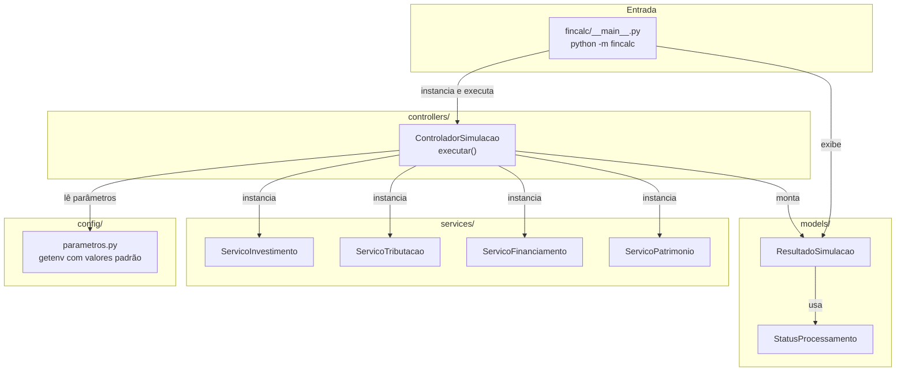
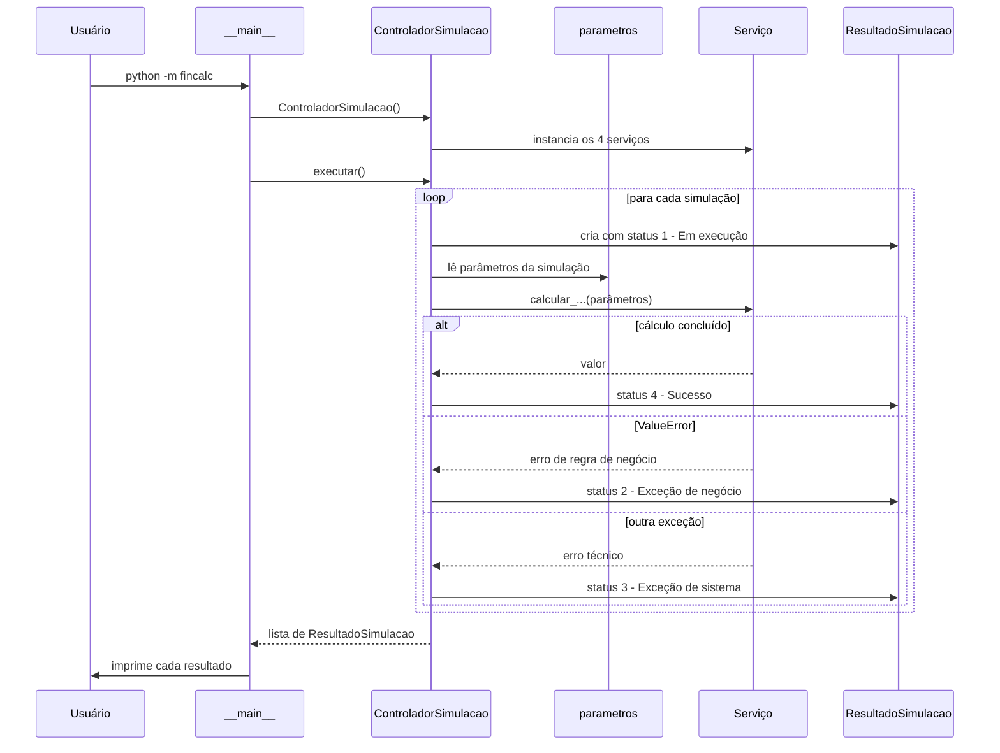
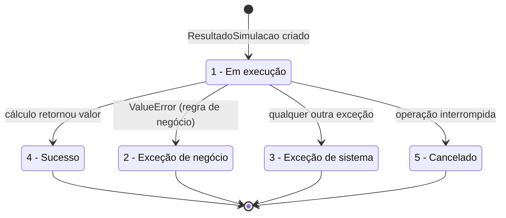
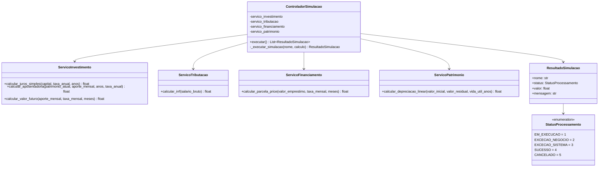
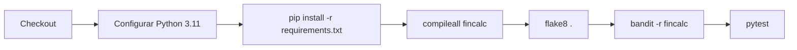
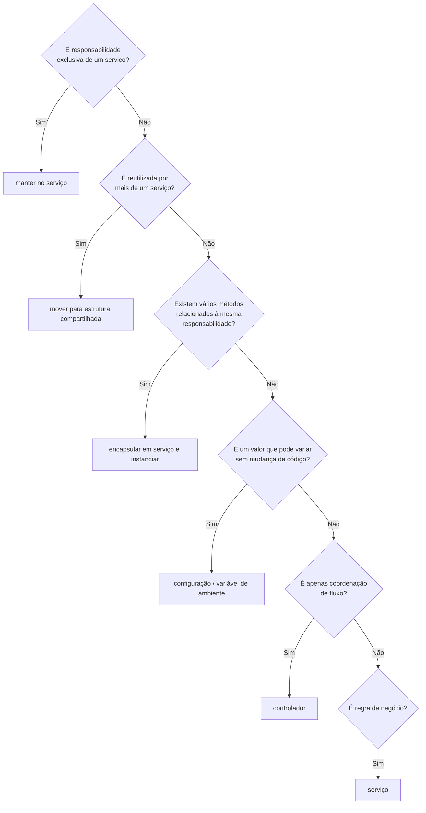

# fincalc-python

Aplicação financeira simples para testes do grupo 2.

O FinCalc é um sistema de cálculos financeiros em Python. Ele reúne simulações de juros simples, aposentadoria, IRRF, Tabela Price, valor futuro e depreciação de ativos, organizadas em camadas seguindo as boas práticas de desenvolvimento descritas no final deste documento.

---

## Sumário

- [Como executar](#como-executar)
- [Estrutura do projeto](#estrutura-do-projeto)
- [Arquitetura](#arquitetura)
- [Fluxo de execução](#fluxo-de-execução)
- [Status de processamento](#status-de-processamento)
- [Serviços disponíveis](#serviços-disponíveis)
- [Configuração por variáveis de ambiente](#configuração-por-variáveis-de-ambiente)
- [Testes e qualidade](#testes-e-qualidade)
- [Como contribuir](#como-contribuir)
- [Boas Práticas de Desenvolvimento](#boas-práticas-de-desenvolvimento)

---

## Como executar

Requisitos: Python 3.11 ou superior.

```bash
pip install -r requirements.txt
python -m fincalc
```

Saída esperada com os parâmetros padrão:

```text
Iniciando o sistema FinCalc...
Juros Simples: R$ 1100.00
Patrimônio Estimado para Aposentadoria: R$ 265277.59
IRRF: R$ 68.56
Tabela Price: R$ 945.60
Valor Futuro: R$ 1530.15
Depreciação Anual: R$ 2250.00
```

---

## Estrutura do projeto

```text
fincalc-python/
├── fincalc/
│   ├── __main__.py                  # ponto de entrada: python -m fincalc
│   ├── config/
│   │   └── parametros.py            # parâmetros lidos de variáveis de ambiente
│   ├── controllers/
│   │   └── controlador_simulacao.py # coordena a ordem de execução das simulações
│   ├── models/
│   │   ├── resultado.py             # ResultadoSimulacao
│   │   └── status.py                # StatusProcessamento (1 a 5)
│   └── services/
│       ├── servico_investimento.py  # juros simples, aposentadoria, valor futuro
│       ├── servico_tributacao.py    # IRRF
│       ├── servico_financiamento.py # Tabela Price
│       └── servico_patrimonio.py    # depreciação linear
├── tests/
│   ├── test_controlador_simulacao.py
│   ├── test_servicos.py
│   └── test_valor_futuro.py
├── .github/workflows/ci.yml         # compilação, flake8, bandit e pytest
├── .flake8
├── pytest.ini
├── requirements.txt
└── README.md
```

Cada pasta tem uma responsabilidade única:

| Pasta          | Responsabilidade                                              |
| -------------- | ------------------------------------------------------------- |
| `config/`      | Configurações e parâmetros externos                           |
| `controllers/` | Coordenação e ordem de execução                               |
| `models/`      | Representação das entidades e estruturas do domínio           |
| `services/`    | Regras de negócio e comportamentos                            |

Não existe pasta `utils/` nem `repositories/` porque hoje não há função reutilizada por mais de um serviço e não há persistência de dados. Elas só devem ser criadas quando houver necessidade concreta.

---

## Arquitetura



A dependência é sempre de cima para baixo. O controlador conhece os serviços, mas nenhum serviço conhece o controlador nem outro serviço. Os serviços não leem variáveis de ambiente: recebem tudo por parâmetro, o que os mantém puros e fáceis de testar.

---

## Fluxo de execução



O controlador não contém regra de negócio. Ele só define a ordem, entrega os parâmetros ao serviço certo, captura a exceção e registra o status. Toda a fórmula fica dentro do serviço.

---

## Status de processamento

Todo resultado de simulação carrega um status seguindo a padronização definida nas boas práticas:

```text
1 - Em execução
2 - Exceção de negócio
3 - Exceção de sistema
4 - Sucesso
5 - Cancelado
```



Regra prática usada no controlador:

| Situação                                   | Status |
| ------------------------------------------ | ------ |
| Serviço lançou `ValueError`                | 2      |
| Serviço lançou qualquer outra exceção      | 3      |
| Serviço retornou um valor                  | 4      |

O status 5 existe na padronização e está disponível no enum, mas ainda não há fluxo de cancelamento na aplicação.

---

## Serviços disponíveis

Cada serviço agrupa os cálculos de uma mesma responsabilidade. Todos devem ser instanciados antes do uso.



### ServicoInvestimento

| Método                    | Fórmula                                                              |
| ------------------------- | -------------------------------------------------------------------- |
| `calcular_juros_simples`  | `capital + capital * (taxa_anual / 100) * anos`                      |
| `calcular_aposentadoria`  | A cada mês: `saldo = (saldo + aporte_mensal) * (1 + taxa_mensal)`    |
| `calcular_valor_futuro`   | `aporte_mensal * meses * (1 + taxa_mensal / 100) ** (meses - 1)`     |

O `calcular_valor_futuro` segue a regra especificada no laboratório. Ele lança `ValueError` para aporte, meses ou taxa negativos e retorna `0.0` quando `meses == 0`.

### ServicoTributacao

`calcular_irrf` aplica a tabela progressiva simplificada:

| Salário bruto até | Alíquota | Dedução  |
| ----------------- | -------- | -------- |
| R$ 2.259,20       | isento   | -        |
| R$ 2.826,65       | 7,5%     | R$ 169,44 |
| R$ 3.751,05       | 15%      | R$ 381,44 |
| acima             | 22,5%    | R$ 662,77 |

As faixas ficam no código porque são constantes intrínsecas ao domínio, não variam por ambiente.

### ServicoFinanciamento

`calcular_parcela_price` calcula a parcela fixa pela Tabela Price:

```text
i = taxa_mensal / 100
parcela = valor_emprestimo * (i * (1 + i) ** meses) / ((1 + i) ** meses - 1)
```

### ServicoPatrimonio

`calcular_depreciacao_linear` calcula a depreciação anual de um ativo:

```text
(valor_inicial - valor_residual) / vida_util_anos
```

### Exemplo de uso direto

```python
from fincalc.services.servico_investimento import ServicoInvestimento

servico = ServicoInvestimento()

montante = servico.calcular_juros_simples(1000.0, 5.0, 2)
patrimonio = servico.calcular_aposentadoria(10000.0, 500.0, 20, 6.0)
```

---

## Configuração por variáveis de ambiente

Os valores usados na simulação padrão podem mudar sem alterar o código, por isso ficam em `fincalc/config/parametros.py` e são lidos com `getenv`. Todas têm valor padrão.

| Variável                              | Padrão    | Usada em                 |
| ------------------------------------- | --------- | ------------------------ |
| `FINCALC_CAPITAL_INICIAL`             | `1000.0`  | Juros simples            |
| `FINCALC_TAXA_ANUAL_JUROS_SIMPLES`    | `5.0`     | Juros simples            |
| `FINCALC_ANOS_JUROS_SIMPLES`          | `2`       | Juros simples            |
| `FINCALC_PATRIMONIO_ATUAL`            | `10000.0` | Aposentadoria            |
| `FINCALC_APORTE_MENSAL_APOSENTADORIA` | `500.0`   | Aposentadoria            |
| `FINCALC_ANOS_APOSENTADORIA`          | `20`      | Aposentadoria            |
| `FINCALC_TAXA_ANUAL_APOSENTADORIA`    | `6.0`     | Aposentadoria            |
| `FINCALC_SALARIO_BRUTO`               | `3000.0`  | IRRF                     |
| `FINCALC_VALOR_EMPRESTIMO`            | `10000.0` | Tabela Price             |
| `FINCALC_TAXA_MENSAL_EMPRESTIMO`      | `2.0`     | Tabela Price             |
| `FINCALC_MESES_EMPRESTIMO`            | `12`      | Tabela Price             |
| `FINCALC_APORTE_MENSAL_VALOR_FUTURO`  | `500.0`   | Valor futuro             |
| `FINCALC_TAXA_MENSAL_VALOR_FUTURO`    | `1.0`     | Valor futuro             |
| `FINCALC_MESES_VALOR_FUTURO`          | `3`       | Valor futuro             |
| `FINCALC_VALOR_INICIAL_ATIVO`         | `5000.0`  | Depreciação              |
| `FINCALC_VALOR_RESIDUAL_ATIVO`        | `500.0`   | Depreciação              |
| `FINCALC_VIDA_UTIL_ANOS_ATIVO`        | `2`       | Depreciação              |

Exemplo no Windows (PowerShell):

```powershell
$env:FINCALC_SALARIO_BRUTO = "5000"
python -m fincalc
```

Exemplo no Linux ou macOS:

```bash
FINCALC_SALARIO_BRUTO=5000 python -m fincalc
```

---

## Testes e qualidade

```bash
flake8 .            # estilo e boas práticas
bandit -r fincalc   # análise de segurança
pytest              # testes automatizados
```

O pipeline em `.github/workflows/ci.yml` roda as mesmas etapas a cada push e pull request na `main`:



Os testes seguem o padrão Arrange, Act, Assert e ficam em `tests/`:

| Arquivo                          | O que cobre                                                        |
| -------------------------------- | ------------------------------------------------------------------ |
| `test_servicos.py`               | Um caso por cálculo de cada serviço, com os valores da simulação   |
| `test_valor_futuro.py`           | Regras de validação e caso de zero meses do valor futuro           |
| `test_controlador_simulacao.py`  | Ordem de execução e mapeamento de exceção para status 2 e 3        |

---

## Como contribuir

1. Crie uma branch a partir da `main` com o prefixo `feature/` ou `fix/`.
2. Coloque regra de negócio em um serviço dentro de `fincalc/services/`. Se o cálculo for da mesma responsabilidade de um serviço existente, adicione um método nele em vez de criar outro.
3. Se o novo cálculo precisar entrar na simulação padrão, registre a chamada em `ControladorSimulacao.executar()` e os parâmetros em `config/parametros.py`.
4. Escreva ao menos um teste em `tests/`.
5. Rode `flake8 .`, `bandit -r fincalc` e `pytest` antes de abrir o pull request.

Fluxo de decisão para saber onde colocar cada coisa:



---

# Boas Práticas de Desenvolvimento

## 1. Instanciação de serviços

Serviços devem ser instanciados antes do uso, principalmente quando houver mais de um método relacionado à mesma responsabilidade.

Preferir:

```python
servico = ServicoRelatorio()

servico.gerar()
servico.enviar()
```

Evitar:

```python
ServicoRelatorio.gerar()
ServicoRelatorio.enviar()
```

Exceção: métodos realmente estáticos, sem dependência de estado, contexto ou instância.

**Como está aplicado no FinCalc:** o `ControladorSimulacao` instancia os quatro serviços no `__init__` e usa as instâncias em `executar()`. Nenhum método de serviço é chamado direto pela classe.

---

## 2. Responsabilidade dos controladores

Controladores devem permanecer pequenos e responsáveis principalmente pela ordem de execução e coordenação das operações.

O controlador deve:

* receber a requisição ou evento;
* validar o fluxo necessário;
* coordenar a execução dos serviços;
* retornar ou finalizar a operação.

Quando o fluxo possuir poucos serviços e baixa complexidade, a orquestração pode permanecer no próprio controlador.

Quando o controlador começar a concentrar muitos serviços, responsabilidades ou fluxos distintos, deve ser dividido.

Como referência, controladores com menos de aproximadamente 10 serviços envolvidos tendem a permanecer administráveis, desde que continuem coesos.

Se houver muitos fluxos diferentes, criar mais de um controlador em vez de transformar um único controlador em um ponto central de toda a aplicação.

**Como está aplicado no FinCalc:** existe um único controlador com 4 serviços e um único fluxo, a simulação padrão. Ele não tem fórmula nenhuma, só ordem de execução e tratamento de status.

---

## 3. Padronização de status

Sempre que houver controle de status de processamento, utilizar a seguinte padronização:

```text
1 - Em execução
2 - Exceção de negócio
3 - Exceção de sistema
4 - Sucesso
5 - Cancelado
```

Significado:

* `Em execução`: processamento iniciado e ainda não finalizado.
* `Exceção de negócio`: falha causada por regra de negócio ou condição esperada.
* `Exceção de sistema`: falha técnica inesperada.
* `Sucesso`: processamento concluído corretamente.
* `Cancelado`: operação interrompida ou cancelada.

Evitar criar novos códigos ou significados diferentes sem necessidade.

**Como está aplicado no FinCalc:** o enum `StatusProcessamento` em `models/status.py` tem exatamente esses cinco códigos, e o `ResultadoSimulacao` nasce com status 1.

---

## 4. Idioma do código

Todo código do projeto deve utilizar português para elementos pertencentes ao domínio da aplicação.

Utilizar português para:

* classes;
* métodos;
* funções;
* variáveis;
* constantes;
* enums;
* mensagens internas;
* regras de negócio;
* nomes de serviços.

Exemplo:

```python
class ServicoNotificacao:
    def enviar_relatorio(self):
        pass
```

Manter em inglês apenas aquilo que pertence ao padrão da linguagem, framework, biblioteca, protocolo ou tecnologia utilizada.

Exemplos:

```python
__init__
getenv
request
response
middleware
Dockerfile
README
```

Não traduzir artificialmente conceitos técnicos padronizados.

**Como está aplicado no FinCalc:** classes, métodos, variáveis e mensagens estão em português. Ficaram em inglês só `__init__`, `__main__`, `getenv`, `dataclass`, `IntEnum` e os nomes das pastas `config`, `controllers`, `models`, `services`, que seguem a convenção da regra 8.

---

## 5. Localização de funções

A localização de uma função deve ser definida pelo seu nível real de reutilização.

### Uso exclusivo

Se uma função for utilizada somente dentro de um serviço, ela deve permanecer dentro daquele serviço ou módulo.

Exemplo:

```python
class ServicoRelatorio:

    def _calcular_total_departamento(self):
        pass
```

Não criar utilitários globais para lógica usada somente em um ponto.

### Uso compartilhado

Se uma função for utilizada por mais de um serviço ou módulo, ela pode ser movida para uma estrutura compartilhada, como `utils`.

Exemplo:

```text
utils/
    datas.py
    formatacao.py
```

Regra:

```text
1 consumidor  → permanece local
2+ consumidores → considerar utils
```

A reutilização deve existir de fato. Não mover funções para `utils` apenas por possibilidade futura.

`utils` não deve se tornar um depósito genérico de funções sem contexto.

**Como está aplicado no FinCalc:** `_executar_simulacao` é usado só pelo controlador e fica nele como método privado. Não existe pasta `utils/` porque nenhuma função tem dois consumidores.

---

## 6. Funções relacionadas devem pertencer a um serviço

Quando houver várias funções relacionadas à mesma responsabilidade, preferir encapsulá-las em um serviço e trabalhar com uma instância.

Preferir:

```python
servico = ServicoArquivo()

servico.validar()
servico.processar()
servico.salvar()
```

Evitar:

```python
validar_arquivo()
processar_arquivo()
salvar_arquivo()
```

quando todas essas funções representam etapas da mesma responsabilidade.

Funções puramente utilitárias, sem estado e sem responsabilidade de negócio própria, não precisam obrigatoriamente virar classes.

**Como está aplicado no FinCalc:** as seis funções soltas do `fincalc.py` original viraram métodos de quatro serviços, agrupados por responsabilidade: investimento, tributação, financiamento e patrimônio.

---

## 7. Variáveis de ambiente e configurações

Valores que possam variar entre ambientes, instalações ou execuções devem ser tratados como configuração.

Utilizar variáveis de ambiente, preferencialmente por meio de `getenv` ou mecanismo equivalente da linguagem.

Exemplo:

```python
from os import getenv

URL_API = getenv("URL_API")
EMAIL_DESTINATARIO = getenv("EMAIL_DESTINATARIO")
TEMPO_LIMITE = getenv("TEMPO_LIMITE", "30")
```

São candidatos a configuração:

* URLs;
* endpoints;
* credenciais;
* tokens;
* e-mails;
* caminhos;
* portas;
* nomes de filas;
* timeouts;
* quantidade máxima de tentativas;
* parâmetros operacionais;
* feature flags;
* identificadores externos;
* qualquer valor que possa precisar ser alterado sem modificar o código.

Não utilizar variável de ambiente para:

* valores calculados em tempo de execução;
* resultados derivados;
* regras internas que não variam por ambiente;
* constantes intrínsecas ao domínio.

Regra geral:

```text
Pode precisar mudar sem alterar o código?
    Sim → configuração / variável de ambiente
    Não → avaliar se deve permanecer no código
```

Nunca armazenar credenciais ou secrets diretamente no código-fonte.

**Como está aplicado no FinCalc:** os valores de entrada da simulação padrão (capital, taxas, prazos, salário) são parâmetros operacionais e ficam em `config/parametros.py` via `getenv`. As faixas do IRRF são constantes do domínio e ficam no serviço.

---

## 8. Separação de responsabilidades

Manter uma divisão clara entre responsabilidades.

```text
controllers/
    coordenação e ordem de execução

services/
    regras de negócio e comportamentos

utils/
    funcionalidades genéricas realmente reutilizadas

config/
    configurações e parâmetros externos

repositories/
    acesso e persistência de dados

models/
    representação das entidades e estruturas do domínio
```

A estrutura exata pode variar conforme framework ou arquitetura, mas a responsabilidade de cada camada deve permanecer clara.

**Como está aplicado no FinCalc:** o pacote `fincalc/` tem `config/`, `controllers/`, `models/` e `services/`. `utils/` e `repositories/` não existem porque ainda não há necessidade.

---

## 9. Princípio de menor complexidade

Não criar abstrações antecipadamente.

Antes de criar:

* novo serviço;
* nova classe;
* novo utilitário;
* nova camada;
* nova interface;
* nova dependência;

verificar se a complexidade realmente exige essa estrutura.

Preferir inicialmente a solução mais simples que:

* seja legível;
* seja testável;
* seja segura;
* preserve separação de responsabilidades;
* permita manutenção adequada.

Generalizar somente quando existir necessidade concreta.

**Como está aplicado no FinCalc:** nenhuma interface, classe base ou injeção de dependência. Os serviços são classes simples sem estado, o resultado é um `dataclass` e o status é um `IntEnum`. Sem dependências além das ferramentas de teste e lint.

---

## 10. Regra geral

Antes de decidir onde colocar uma responsabilidade, aplicar esta sequência:

```text
É responsabilidade exclusiva de um serviço?
    → manter no serviço

É reutilizada por mais de um serviço?
    → mover para estrutura compartilhada

Existem vários métodos relacionados à mesma responsabilidade?
    → encapsular em serviço e instanciar

É um valor que pode variar sem mudança de código?
    → configuração / variável de ambiente

É apenas coordenação de fluxo?
    → controlador

É regra de negócio?
    → serviço
```

O objetivo é manter o código simples, previsível, reutilizável quando necessário e sem abstrações desnecessárias.
